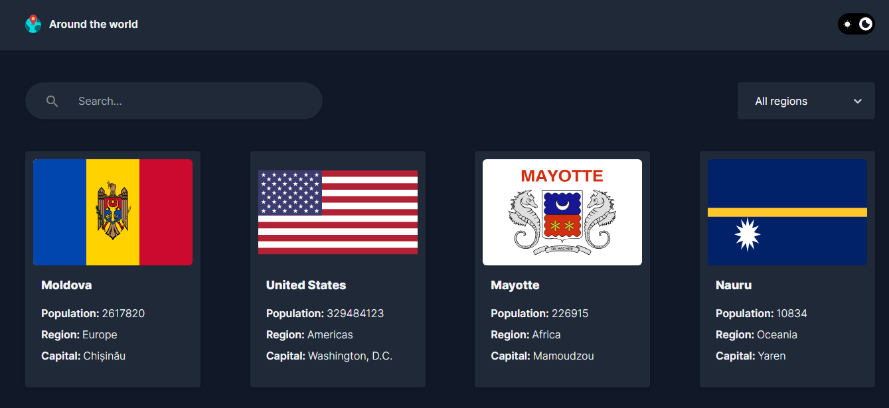

# Around-The-World

Discover Around The World — the web application that transforms exploring countries into a delightful and effortless experience. With its sleek design and outstanding features, you can easily access comprehensive information about various countries. Enjoy exploring the intriguing functionalities of Around The World and redefine your digital journey with this unique platform.



## [🌟Live Website🌟](https://around-the-world-rho.vercel.app/)

## Table of Contents

- [Features](#features)
- [Technologies Used](#technologies-used)
- [Set Up ](#set-up)
- [Contact](#contact)

## Featured Skills

1. **React**: Utilized for building the frontend interface, providing dynamic and interactive components.
2. **Vite**: Employed as the build tool to optimize and bundle the project for production.
3. **Tailwind CSS**: Integrated for responsive and customizable styling, enhancing the visual aesthetics of the website.
4. **Rest API**: enabled the app to send and receive data between the server and the client.
5. **Details**: Accessed more information about each country.
6. **Search Functionality**: Implemented a search feature to enable users to find Countries efficiently.

## Technologies Used

- **React**: JavaScript library for building user interfaces.
- **Vite**: Fast, modern build tooling for frontend development.
- **Tailwind CSS**: Utility-first CSS framework for rapid UI development.
- **Rest API**: Manage data.
- **Git** (for version control)
- **Responsive For Mobile**

## Set Up

To set up and run the project locally, follow these steps:

1. Clone the repository to your local machine:

   ```bash
   git clone https://github.com/ahmed-ali-9-6/Around-The-World
   ```

2. Navigate to the project directory:

   ```bash
   cd Around-The-World
   ```

3. Install the project dependencies:

   ```bash
   npm install
   ```

4. Start the development server:
   ```bash
   npm run dev
   ```

## Contact

- [Author](https://github.com/ahmed-ali-9-6)
- [Website](https://ahmed-ali-9-6.github.io/My-Portfolio/)
- [Email](mailto:ahmed.ali.hassan108@gmail.com)
- [LinkedIn](https://www.linkedin.com/in/ahmed-ali-993011215/)
